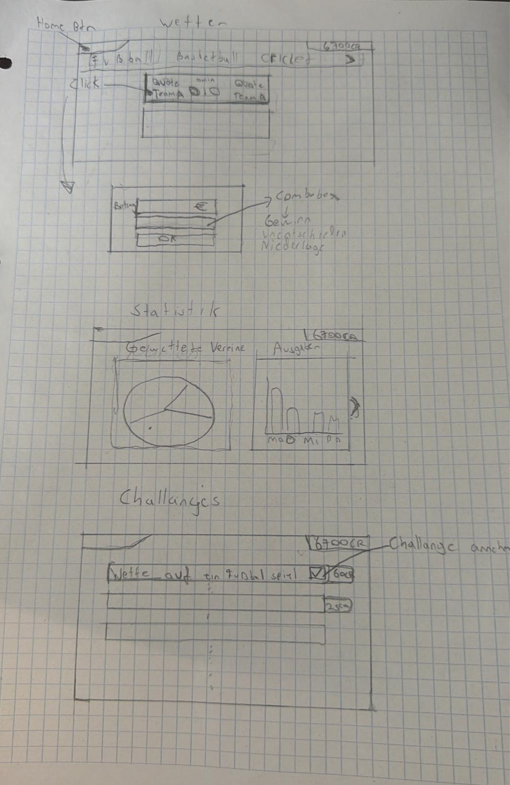
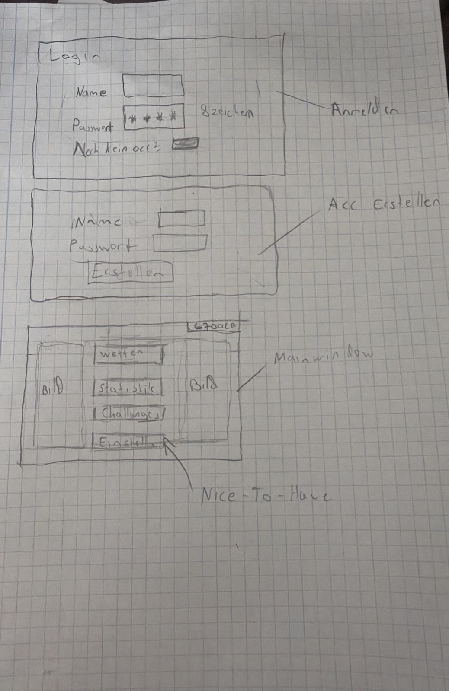
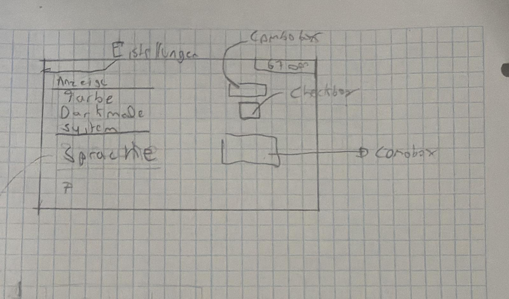
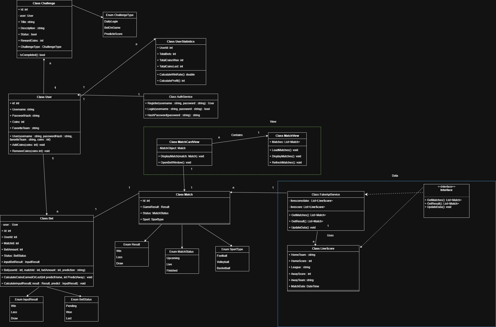

# Bet Fanaticos Dokumentation 

## Projekttagebuch

### Kenan:

| Datum | Tätigkeit |
|---------|-----------|
| 28.05.2026 | Grundlegende Klassen und Datenstrukturen des Projekts implementiert sowie mit der Entwicklung des API-Service begonnen. |
| 30.05.2026 | Die Matchansicht und verschiedene UserControls für die Benutzeroberfläche entwickelt. |
| 02.06.2026 | Fehler behoben, kleinere Verbesserungen vorgenommen und ein Wettfenster hinzugefügt. |
| 03.06.2026 | Tests durchgeführt und den Projektstand mit dem Main-Branch synchronisiert. |
| 08.06.2026 | Änderungen aus dem Main-Branch übernommen. |
| 10.06.2026 | Die Basketball-API integriert, das Registrierungsfenster erstellt und die Fehlerbehandlung erweitert. |
| 15.06.2026 | Das Design der Hauptansicht verbessert, weitere Sportarten angebunden und mit der Wettlogik begonnen. |
| 16.06.2026 | Logs und Unit-Tests erstellt sowie Merge-Konflikte behoben. |
| 17.06.2026 | Session-Handling und Coin-Verwaltung implementiert sowie die Wettlogik weiterentwickelt. |
| 18.06.2026 | Die Implementierung der Wettlogik abgeschlossen. |

### Emir:
| Datum      | Tätigkeit                                                                                      |
| ---------- | ---------------------------------------------------------------------------------------------- |
| 18.06.2026 | Merge-Konflikte gelöst, Challenge finalisiert und Abschluss-Commits gemacht                    |
| 17.06.2026 | Challenge-/Login-Funktion weiterentwickelt und abgeschlossen                                   |
| 16.06.2026 | Login & Registrierung fertiggestellt, Sessionservice/Fakeservice erstellt, Konflikte angepasst |
| 14.06.2026 | Authentifizierung fertiggestellt und Rollen wie Admin/User hinzugefügt                         |
| 10.06.2026 | API-/Pfad-Anpassungen aktualisiert                                                             |
| 01.06.2026 | Tabellen erstellt                                                                              |
| 31.05.2026 | Authentication-Feature gemerged und Ordnerstruktur überarbeitet                                |
| 30.05.2026 | Login inkl. XAML fertiggestellt                                                                |
| 28.05.2026 | Datenmodell, Engine, Session und Challenge-Klasse angefangen/umgesetzt                         |
| 23.05.2026 | Authservice mit Login/Register implementiert und an XAML gearbeitet                            |
| 20.05.2026 | Grundstruktur eingerichtet und Projektdokumentation erstellt                                   |

## Projektplanung (Lastenheft)  

### Beschreibung der Applikation:
Die WPF-Anwendung ist eine Wettsimulation und dient ausschließlich zu Bildungszwecken. Sie soll verdeutlichen, welche Auswirkungen Sportwetten haben und wie sich Wettverhalten auf Spieler auswirken kann.

Im Spiel erhalten die Nutzer eine bestimmte Anzahl an Wett-Coins, mit denen sie virtuelle Wetten platzieren können. Täglich werden rund 100 Spiele aus verschiedenen Sportarten wie Fußball, Basketball und Volleyball angezeigt, auf die gewettet werden kann.

Zusätzlich gibt es tägliche Challenges, die abgeschlossen werden können, um weitere Wett-Coins zu verdienen. Diese Herausforderungen sorgen für zusätzliche Motivation und Abwechslung innerhalb der Simulation.

Ziel der Anwendung ist es, ein realistisches Wettgefühl zu vermitteln, ohne dass dabei echtes Geld eingesetzt wird.

### Must Have:
- Anmelden/Registrieren 
- Geldsystem 
- Wett-API (Ergebnisse, Tore etc )
- Belohnungen 
- Liebligsteam speichern // Aus zeitlichen gründen nicht geschafft
- Statisitken (Verlust/Gewinn etc) // wird momentan im Backend nur ausgerechnet

### Nice to have:
- Notification 
- Wett-Erweiterung (Spielerleistung etc)
- GUI-Anpassung 
- Belohnung erweitern 
- Hintergrundmusik 

## GUI

## UML 

## Zuständigkeit
| Kenan | Emir |
|---|---|
| User | AuthService |
| Match | Challenge |
|  Bet| UserStatistics |
| BetService | ChallengeService | 
| MatchCardView | SessionService |
| MatchView | ChallangeManager |
| Unittests | Models|
| CoinStorage (Wallet) |
| ApiService|

Kenan hat ebenfalls im Backend sämtliche Router implementiert und die Web-APIs im Backend aufgerufen
Emir hat auch Router implementiert, und Api-keys, authentifizierung und hashing implementiert im Backend 

## Meilensteine

| Meilenstein | Beschreibung | Datum |
|---|---|---|
| M1 | Projektidee und Anforderungen festlegen | 07.05.2026 |
| M2 | GUI-Skizzen und grundlegendes Design erstellen | 13.05.2026 |
| M3 | UML-Diagramm und Projektbeschreibung fertigstellen | 14.05.2026 |
| M4 | Grundfunktionen ohne KI-Unterstützung implementieren (Matches anzeigen, Wetten platzieren, FakeAPI, Coins-System) | 30.05.2026 |
| M5 | Zwischenpräsentation des aktuellen Projektstands | 30.05.2026 |
| M6 | Erweiterungen, Fehlerbehebung und Optimierungen mit unterstützender KI-Nutzung durchführen | 10.06.2026 |
| M7 | Endpräsentation und Projektdokumentation fertigstellen | 17.06.2026 |

## Umsetzungsdetails 

## Softwarevoraussetzungen 

#### Entwicklungsumgebung
- Microsoft Visual Studio 2022
- Python 3.13
- .NET 8.0
- Git zur Versionsverwaltung
#### Frontend
- WPF (Windows Presentation Foundation)
- C#
#### Backend
- FastAPI
- Uvicorn
- Pydantic
- SQLAlchemy
- fastapi-restful
- Datenbank
- SQLite
#### Externe Schnittstellen
- Football-Data.org API v4
- TheSportsDB API
#### Verwendete Bibliotheken
- Serilog (Logging)
- System.Net.Http
- System.Text.Json
- HttpClient

## Funktionsblöcke bzw. Architektur
 
**Die Anwendung besteht aus einem WPF-Frontend, einem FastAPI-Backend und einer SQLite-Datenbank.**

#### **WPF-Frontend**
- Das Frontend stellt die Benutzeroberfläche bereit. Nutzer können sich anmelden, Spiele anzeigen lassen, Wetten platzieren, Coins sehen und Challenges aufrufen.

#### **FastAPI-Backend**
- Das Backend stellt REST-Endpunkte bereit. Es verarbeitet Login, Registrierung, Wallet-Daten, Wetten und Matchdaten.

#### **SQLite-Datenbank**
- In der Datenbank werden Benutzer, Coins, Wetten, Wallets und Challenges gespeichert.

#### **Externe APIs**
- Für die Spieldaten werden externe Sport-APIs verwendet.

## Detaillierte Beschreibung der Umsetzung

- Die Anwendung wurde mit C# und WPF umgesetzt. Das Frontend kommuniziert über REST-Schnittstellen mit einem FastAPI-Backend. Die Daten werden in einer SQLite-Datenbank gespeichert.

- Nach dem Anmelden wird der Benutzer geladen und seine Coins aus dem Wallet übernommen. Die verfügbaren Spiele werden über externe Sport-APIs abgerufen und im Frontend angezeigt.

- Beim Platzieren einer Wette wird zunächst geprüft, ob genügend Coins vorhanden sind und ob alles ausgefüllt worden ist. Anschließend wird der Einsatz vom Wallet abgezogen und die Wette mit den zugehörigen Informationen wie Einsatz, Quote, Vorhersage und Match-ID gespeichert.

- Die Ergebnisse der Spiele werden regelmäßig über die Sport-APIs aktualisiert. Sobald ein Spiel beendet ist, werden offene Wetten ausgewertet. Bei einem richtigen Tipp wird der Gewinn anhand der Quote berechnet und dem Wallet des Benutzers gutgeschrieben.

- Zusätzlich verfügt die Anwendung über eine Benutzerverwaltung, ein Wallet-System, Statistiken sowie Challenges zur Belohnung der Benutzeraktivität.

## Mögliche Probleme und ihre Lösung
### Kenan:

| Problem | Lösung |
|-----------|--------|
| Match-ID war immer 0 | Die Match-ID wurde direkt aus den externen APIs übernommen. |
| Coins wurden nicht benutzerspezifisch gespeichert | Einführung eines Wallet-Systems pro Benutzer. |
| Fehler beim Laden der Matchdaten | Kommunikation zwischen Frontend und Backend überprüft und korrigiert. |
| Fehlende Datenbankspalten führten zu SQL-Fehlern | Datenbankmodell erweitert und Datenbank neu erstellt. |
| Probleme mit der Auswertung offener Wetten | Speicherung von Match-ID, Quote und Vorhersage ergänzt. |
| Vergangene Spiele wurden angezeigt | Filter für zukünftige Spiele implementiert. |
| Probleme bei der Kommunikation zwischen WPF und FastAPI | REST-Endpunkte getestet und Fehlerbehandlung erweitert. |
| Externe Sport-APIs lieferten zeitweise keine Daten | Fehlerbehandlung eingebaut und alternative Sportarten verwendet. |
| Unterschiedliche Datenformate der APIs | Daten vor der Anzeige vereinheitlicht und konvertiert. |

### Emir

| Problem | Lösung |
|---|---|
| Authentifizierung und Registrierung wurden im Client zunächst nur über lokale Objekte bzw. Listen geprüft. | Die Authentifizierung wurde ins Backend verlagert. Benutzer werden in der Datenbank gespeichert, Passwörter werden gehasht und für eingeloggte Benutzer wird ein API-Key verwendet. |
| Aktionen mussten dem richtigen eingeloggten User zugeordnet werden. | Dafür wurde ein `SessionService` erstellt. Das ist eine statische Klasse, die den aktuell eingeloggten User im Frontend global verfügbar hält, damit API-Aufrufe immer mit der richtigen `user_id` an das Backend gesendet werden. |
| Challenges waren zuerst nur als Dummy-Daten im Client gespeichert. | Die Challenges wurden ins Backend bzw. in die Datenbank verlagert. Über einen Seed-Endpoint können die Challenge-Vorlagen per SwaggerUI erstellt werden, und der Client lädt sie anschließend über die API. |
| Fehlermeldungen aus dem Backend sollten im Frontend verständlich angezeigt werden. | Backend-Fehler werden als JSON-Antwort an den Client gesendet. Im Frontend werden diese Antworten ausgelesen und als verständliche Fehlermeldung angezeigt. |
| Fake-Service und echte REST-API sollten beide verwendbar sein. | Es wurde ein gemeinsames Interface verwendet. Über eine boolesche Variable wird im Konstruktor entschieden, ob der Fake-Service oder der echte REST-Service verwendet wird. |

## Quellen für verwendete Bilder oder andere Medien

### Hintergrundbild

- Verwendet als Hintergrundbild der Anwendung.
- Quelle: PNGTree
- Das Bild ist kostenlos herunterladbar.

Link: https://pngtree.com/freebackground/soccer-field-and-spotlight-background-in-the-stadium_16093827.html?utm_source=chatgpt.com

### Verwendete APIs
- Football-Data.org API (Fußballspiele und Ergebnisse)
- TheSportsDB API (Basketball- und Baseballspiele)

### Verwendete Icons und Emojis
- Standard-Emojis von Unicode
- Keine urheberrechtlich geschützten Icons verwendet

## Link auf das Repository
https://github.com/User-Kenan/BetFanaticos.git